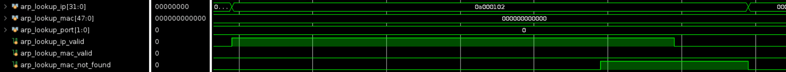
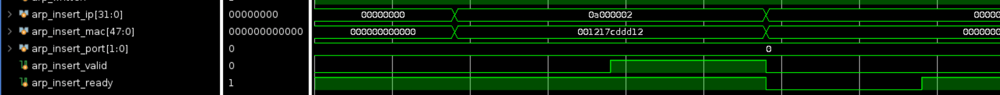

# ARP Table

代码：`arp_table.sv`

设计：支持从 IP 查询 (MAC, PORT) ，和插入 (IP, MAC, PORT) 表项的 ARP 表

## 查询

查询过程：

1. 设置 `lookup_ip` 并保持不变，拉高 `lookup_ip_valid`
2. 若干周期后，如果找到了结果，`lookup_mac_valid` 则为高电平，否则 `lookup_mac_not_found` 为高电平。
3. 输出结果也会同时输出到 `lookup_mac` 和 `lookup_port`

### 查询成功样例

上面是一个查询成功的例子，查询了 10.0.1.2 的 IP 地址，返回了 MAC 地址 00:12:17:CD:DD:21 ，端口为 1 。

## 查询失败样例

上面是一个查询失败的例子，查询了 10.0.1.2 的地址，找不到对应的 MAC 地址。

## 插入

插入时，通过 `ready` 信号和 `valid` 信号进行协商。当 `valid` 为高时，才允许插入数据。插入数据时，设置 `valid` 为高电平一个周期，同时在 `insert_ip` 和 `insert_mac` 上写数据。若干个周期后，`ready` 会重新恢复为高电平，表示准备好了下一次写入。

## TODO

实现对 IP 地址的哈希。